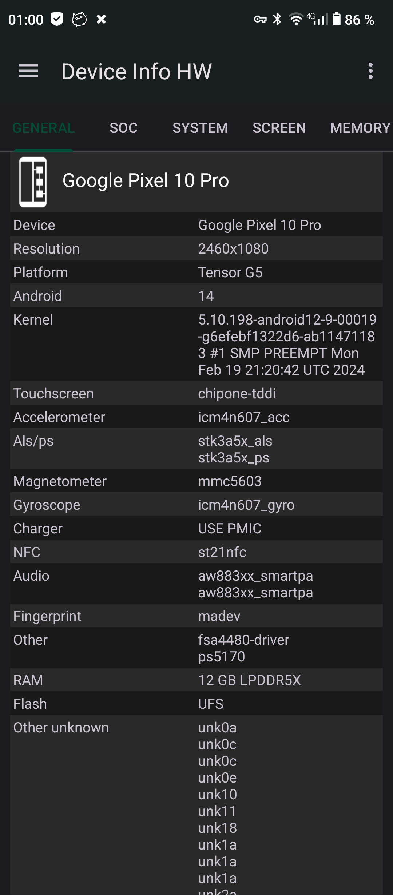
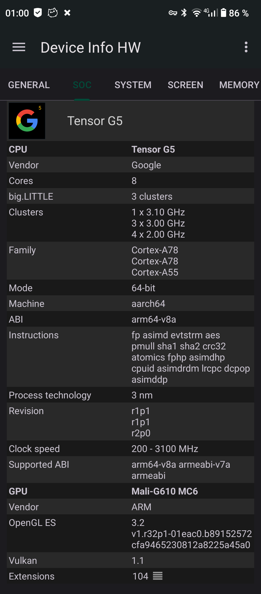
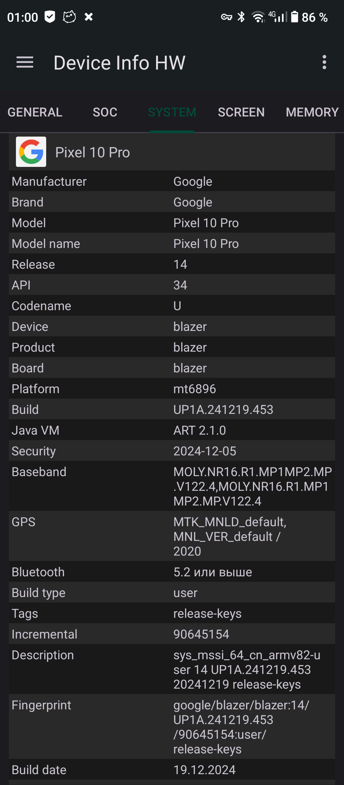

# IDsC

IDsC is an Android utility for applying device identity profiles on rooted Android devices.

The app lets you select a predefined device profile and generate a shell script that applies device identity-related system properties.

## What It Does

- Provides a bundled catalog of Android device profiles
- Generates a shell script for the selected profile
- Updates device-related values such as:
  - build fingerprint
  - model name
  - manufacturer
  - brand
  - device name
  - product name
  - other build metadata

- Saves the generated script for reuse after reboot
- Targets rooted Android devices

## Screenshots

<p>
  
  
</p>

<p>
  
  
  
</p>

## Stack

- Kotlin
- Android
- Jetpack Compose
- Material 3
- Navigation Compose

## Requirements

- Android device
- Root access
- Android 14 or newer

## Development

Clone the repository:

```bash
git clone https://github.com/olezhaku/IDsC.git
cd IDsC
```

Build debug APK:

```bash
./gradlew assembleDebug
```

Build release APK:

```bash
./gradlew assembleRelease
```

The generated APK files can be found in:

```text
app/build/outputs/apk/
```

## Notes

- This project is intended for rooted Android devices only.
- Generated scripts modify device identity-related properties.
- Review generated scripts before applying them.
- Use at your own risk.
- Some changes may require a reboot to take effect.
- Behavior may vary depending on ROM, Android version, root solution, and device configuration.

## License

This project is licensed under the MIT License. See the [LICENSE](./LICENSE) file for details.
