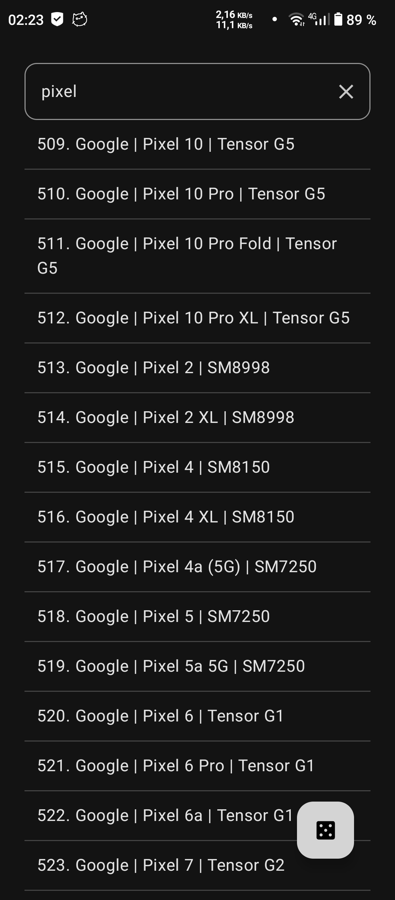
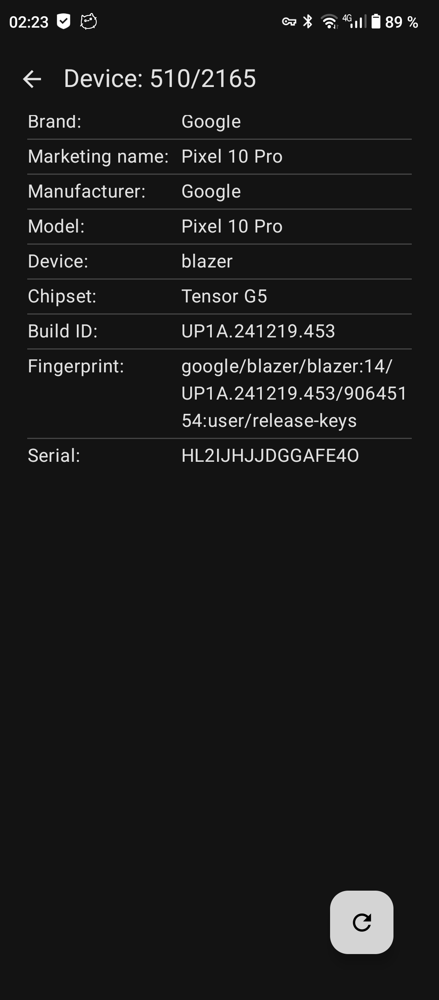

  

# IDsC

IDsC is an Android utility for applying device identity profiles on rooted Android devices.

The app lets you select a predefined device profile and apply device identity-related system properties.
It can also expose the selected profile name over MTP when the Xposed module is enabled.

## What It Does

- Provides a bundled catalog of Android device profiles
- Applies the selected profile
- Changes the MTP device name through LSPosed/Xposed
- Updates device-related values such as:
  - build fingerprint
  - model name
  - manufacturer
  - brand
  - device name
  - product name
  - other build metadata

- Targets rooted devices

## Screenshots

  
  

  
  
  

  

## Requirements

- Android 14 or newer
- Root access
- LSPosed/Xposed for MTP device name spoofing

## Notes

- This project is intended for rooted Android devices only.
- MTP name spoofing requires enabling the module in LSPosed/Xposed.
- Applied profiles modify device identity-related properties.
- Use at your own risk.
- Some changes may require a reboot to take effect.
- Behavior may vary depending on ROM, Android version, root solution, and device configuration.

## License

This project is licensed under the GNU General Public License v3.0 or later. See the [LICENSE](./LICENSE) file for details.
